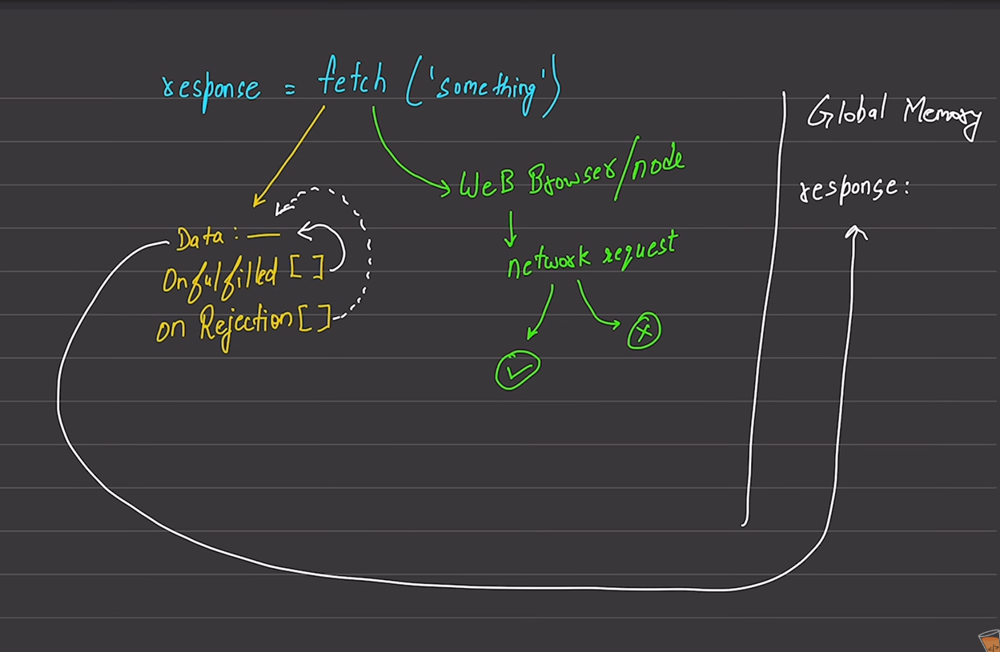

🔹 JAVASCRIPT ASYNC FLOW EXPLAINED
----------------------------------

🧠 1. CALL STACK (a.k.a. MEMORY STACK)
--------------------------------------

- Executes JavaScript code line by line.
- It’s like a pile of plates (LIFO: Last In First Out).
- Synchronous (normal) code goes here.

Example:

console.log("1: Start"); goes to call stack and runs immediately

⏲️ 2. WEB API (Handled by browser)
setTimeout(() => {
  console.log("2: setTimeout"); sent to Web API and waits for 0ms (async)
}, 0);

📦 3. MICROTASK QUEUE (for Promises, async/await)                     //For fetch :mostly for making high priority queue
Promise.resolve().then(() => {
  console.log("3: Promise then"); goes to microtask queue (executes BEFORE setTimeout)
});

Synchronous code continues...
console.log("4: End");

🔁 EVENT LOOP
-------------

- Keeps checking the call stack.
- If stack is empty, it pushes tasks from microtask queue first, then callback queue.

Output of this code:
--------------------

1: Start
4: End
3: Promise then   ✅ Microtask runs first!
2: setTimeout     ✅ Callback runs after that

WHY? Because Microtasks (Promise, async/await) have higher priority.

🔍 ANALOGY (Very Simple):
-------------------------

- Call Stack → The Chef (cooks current order)
- Web API    → The Waiters (do delayed work like delivery)
- Microtasks → VIP orders (priority serving)
- Callback Queue → Normal delivery orders
- Event Loop → The Manager (keeps assigning new work to the chef when free)

🔸 Let’s add async/await to the mix
async function asyncFunc() {
  console.log("5: Inside async function");
  await Promise.resolve();  this line pauses here and goes to microtask queue
  console.log("6: After await"); this will run AFTER all synchronous code is done
}

asyncFunc();

console.log("7: Outside async");

Final Output:
-------------

1: Start
4: End
5: Inside async function
7: Outside async
3: Promise then          (microtask)
6: After await           (microtask)
2: setTimeout            (callback)

📌 Summary of Priorities:
-------------------------

1. Synchronous code (Call Stack)
2. Microtasks (Promise.then, async/await resolved)
3. Callback Queue (setTimeout, DOM events, etc.)

✅ This is how JavaScript handles async operations behind the scenes!

Most Important Async Operations in JavaScript:

setTimeout() – Delays execution by some time
setInterval() – Repeats execution at time intervals
Promise – Core way to handle async results
async / await – Modern, clean way to write async code using Promises
fetch() – Makes HTTP requests (used to call APIs)
Event Listeners – Like click, input, keydown (async behavior)

